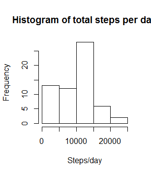
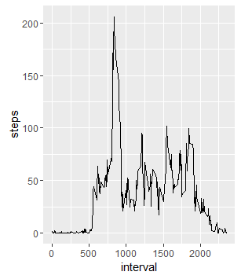
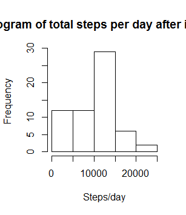
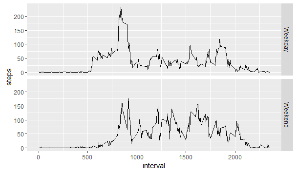

# Reproducible Research: Peer Assessment 1


## Loading and preprocessing the data

```r
unzip("activity.zip")
activity <- read.csv("activity.csv", stringsAsFactors = FALSE)
activity$date <- as.Date(activity$date)
head(activity)
```

```
##   steps       date interval
## 1    NA 2012-10-01        0
## 2    NA 2012-10-01        5
## 3    NA 2012-10-01       10
## 4    NA 2012-10-01       15
## 5    NA 2012-10-01       20
## 6    NA 2012-10-01       25
```

## What is mean total number of steps taken per day?

```r
library(dplyr)
stepsperday <- activity %>% group_by(date) %>% summarize(steps=sum(steps,na.rm = TRUE))
head(stepsperday)
```

```
## Source: local data frame [6 x 2]
## 
##         date steps
##       (date) (int)
## 1 2012-10-01     0
## 2 2012-10-02   126
## 3 2012-10-03 11352
## 4 2012-10-04 12116
## 5 2012-10-05 13294
## 6 2012-10-06 15420
```

```r
hist(stepsperday$steps, main = "Histogram of total steps per day", xlab = 'Steps/day')
```



The mean total steps is 9,354.23 and median total steps is 10,395


## What is the average daily activity pattern?

```r
library(ggplot2)

stepsperinterval <- activity %>% group_by(interval) %>% summarise(steps = mean(steps, na.rm = TRUE))

mostActiveInterval = stepsperinterval[which.max(stepsperinterval$steps), ]$interval

ggplot(stepsperinterval, aes(x= interval, y=steps)) + geom_line()
```



On average 8 35 - 8 40  has most number of steps during the study period

## Imputing missing values
We will impute missing values with average number of steps during that interval rounded off to nearest integer.

```r
avgStepsInInterval <- function (interval, stepsperinterval) {
  round(stepsperinterval[stepsperinterval$interval == interval,]$steps)
}

imputedactivity <- activity %>% mutate(steps = ifelse(is.na(steps), avgStepsInInterval(interval, stepsperinterval), steps))

imputedstepsperday <- imputedactivity %>% group_by(date) %>% summarize(steps=sum(steps,na.rm = TRUE))
hist(imputedstepsperday$steps, main = "Histogram of total steps per day after imputing", xlab = 'Steps/day')
```



The mean total steps now is 9,530.656 and median total steps is 10,439. The histograms look similar and the means, medians and total steps have slightly increased. 

## Are there differences in activity patterns between weekdays and weekends?

```r
imputedactivity <- imputedactivity %>% mutate(day = factor(ifelse(weekdays(date) %in% c('Sunday','Saturday'), 'Weekend', 'Weekday')))

imputedstepsperinterval <- imputedactivity %>% group_by(interval, day) %>% summarise(steps = mean(steps, na.rm = TRUE))


ggplot(imputedstepsperinterval, aes(x= interval, y=steps)) + geom_line() +
  facet_grid(day~.)
```



We can see during weekdays our subject starts early and rushes to work in the morning and is only modaretely active in the evening threafter whereas in the weekends, sleeps slightly more and is fairly active throughout the day.